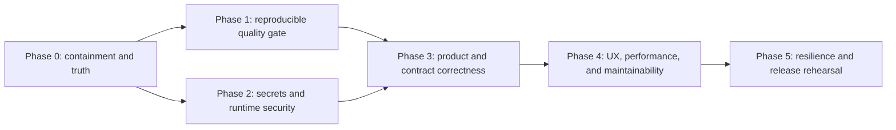

# Production Readiness Remediation Plan

**Status:** In progress

**Created:** 2026-07-12

**Source audit:** `quality-review.md`

**Branch:** `codex/production-readiness-remediation`

**Release posture:** Blocked until gates G0-G5 pass

## Objective

Resolve every critical and important finding in the production-readiness audit, satisfy the refined user-story acceptance criteria, and produce reproducible evidence that a clean checkout is safe to release.

This plan is ordered to contain risk first, establish trustworthy verification second, repair product behavior third, and harden the release candidate last. A passing build alone is not completion.

## Safety and scope decisions

- Do not deploy or mutate production infrastructure from this worktree.
- Use Stripe test mode only. No live-money or live-trading activity is authorized.
- Keep stream clipping, CDN mirroring, live feed, and watch parties disabled by default until their individual release gates pass.
- Treat the responsive web application as the current launch client. Native mobile remains out of launch scope unless a buildable mobile workspace is supplied and accepted.
- Preserve the pre-existing user changes in `Makefile`, `README.md`, `backend/config/config.go`, `backend/internal/services/embedding_service.go`, and `Taskfile.yml`. When remediation overlaps those files, isolate and review the relevant hunks before committing.
- Never hide a failing or empty test suite. Missing prerequisites, zero discovered tests, unexpected skips, and unhandled test warnings are failures.
- Make one focused commit after each independently validated milestone.

## Evidence model

Each task must end with four forms of evidence:

1. **Implementation:** reviewed diff with no unrelated user changes.
2. **Automated verification:** the commands listed for the task pass.
3. **Behavioral proof:** a focused test or inspection proves the requirement rather than merely exercising nearby code.
4. **Traceability:** the task status and evidence are recorded in this plan.

Task states are `TODO`, `IN PROGRESS`, `BLOCKED`, or `DONE`. A phase is complete only when all tasks and its exit gate are `DONE`.

## Dependency flow

## Release gates

| Gate | Required evidence |
|---|---|
| G0 — containment | No secret logging; incomplete production paths disabled; public claims identify pre-release scope |
| G1 — reproducible verification | Clean install; backend test/race/vet; frontend lint/build/unit; non-zero Playwright discovery; vulnerability and OpenAPI checks in required CI |
| G2 — security | Fail-closed production configuration; zero unaccepted critical/high vulnerabilities; protected operational endpoints; authorization matrix passes |
| G3 — product correctness | Media, payment, analytics consent, account lifecycle, and advertised feature behavior meet acceptance tests |
| G4 — beta quality | Critical journeys pass accessibility, browser, performance, and API contract budgets |
| G5 — release rehearsal | Immutable artifacts, backup/restore, migration rollback, graceful drain, smoke, and rollback drills pass against the candidate |

## Phase 0 — Containment, baseline, and product truth

### R0.1 — Establish remediation tracking

- **State:** DONE
- **Owner role:** Release lead
- **Work:** Create this plan, map all audit findings, establish gates, and work on a non-default branch.
- **Verification:** Branch is not `main`; this plan covers C1-C4, I1-I11, US-R1/A1/C1/P1/C2/M1/O1/X1/D1, and all hardening recommendations.

### R0.2 — Prevent unsafe feature activation

- **State:** DONE
- **Owner role:** Backend + release engineering
- **Work:** Add centrally validated, false-by-default flags for stream clip extraction, CDN, mirroring, live feed, and watch parties. Do not register mutating/expensive backend routes when disabled. Return a stable `feature_disabled` API error where route compatibility is required.
- **Acceptance:** A production-profile test proves every incomplete feature is disabled without an explicit valid configuration; frontend navigation cannot expose disabled features.
- **Verification:** Focused Go configuration/router tests and frontend route tests.

### R0.3 — Remove immediate secret exposure

- **State:** DONE
- **Owner role:** Backend security
- **Work:** Remove private-key logging immediately. Permit ephemeral JWT keys only in an explicit development profile. Add a regression test that captures logs and proves key material is absent.
- **Acceptance:** Staging/production startup fails if JWT key material is missing; development logs a fingerprint only.
- **Verification:** Focused infrastructure/config tests plus repository secret-pattern scan.

### R0.4 — Publish accurate pre-release scope

- **State:** DONE
- **Owner role:** Product + documentation
- **Work:** Correct the README and feature inventory immediately: web client only; hidden/disabled features marked planned; CI/test counts derived from current evidence; obsolete quick-start links and commands removed or fixed.
- **Acceptance:** No native-mobile, workflow-count, test-count, CDN, mirroring, live-feed, or watch-party completeness claim exceeds executable evidence.
- **Verification:** Documentation checks and clean-checkout command validation.

### Phase 0 exit — G0

- **State:** TODO
- No unsafe fallback or placeholder path can be enabled accidentally.
- Release status and available clients/features are truthful.
- Any JWT key that may have reached non-local logs is identified for operator rotation; rotation itself is an external operational action and must be reported if access is unavailable.

## Phase 1 — Reproducible build, test, and CI gate

### R1.1 — Repair the task-runner contract

- **State:** DONE
- **Owner role:** Developer experience
- **Depends on:** R0.1
- **Work:** Reconcile `Taskfile.yml` and the compatibility `Makefile` with files that actually exist. Remove unsupported targets or implement their assets. Replace silent `|| true` behavior for required setup with explicit failure. Add a side-effect-free target verifier.
- **Acceptance:** Every public task either runs, clearly reports an optional prerequisite, or is removed. Required setup cannot succeed with absent seeds/migrations. Package-specific integration targets validate that the package exists and discovers tests.
- **Verification:** `task --list`, task contract test, and dry-run/summary checks.

### R1.2 — Add mandatory source CI

- **State:** IN PROGRESS — source workflow now enforces backend test/vet/build,
  frontend audit/lint/test/build, non-zero browser discovery, and real-backend
  cross-browser smoke with diagnostic artifacts. Hosted execution and skip-budget
  integration remain before this task is `DONE`.
- **Owner role:** Platform engineering
- **Depends on:** R1.1
- **Work:** Add a pull-request workflow for clean dependency install, backend test/race/vet, frontend lint/build/unit, Playwright discovery/smoke, OpenAPI validation/coverage, docs validation, dependency scanning, secret scanning, SBOM generation, and container build/scan.
- **Acceptance:** Required jobs fail on zero tests, unexpected skips, lint errors, vulnerable high/critical dependencies without an unexpired exception, or missing artifacts.
- **Artifacts:** Test counts, coverage, skip inventory, bundle sizes, SBOM, migration version, OpenAPI coverage, and image digest.

### R1.3 — Resolve frontend lint errors

- **State:** DONE
- **Owner role:** Frontend
- **Depends on:** R1.2 can run in parallel
- **Work:** Correct all 13 errors, including set-state-in-effect, impure render, render-time ref access, and invalid Vite configuration. Triage warnings and establish a warning budget that trends to zero.
- **Acceptance:** `npm run lint` exits zero; no disable comment is added without a precise rationale and focused test.
- **Verification:** Frontend lint and affected unit tests.

### R1.4 — Repair frontend unit/component tests

- **State:** DONE
- **Owner role:** Frontend + QA
- **Depends on:** R1.3
- **Work:** Classify all 69 failures as implementation defects or stale tests. Repair analytics configuration injection, provider-aware render helpers, modal state restoration, accessibility primitives, and order-dependent search-state tests. Replace exact Tailwind assertions with accessible/behavioral outcomes.
- **Acceptance:** Two consecutive full runs pass with identical totals; React `act`, unhandled-request, canvas, and navigation warnings are either eliminated or intentionally provided by shared test adapters.
- **Verification:** `npm test -- --run` twice, with machine-readable result comparison.

### R1.5 — Restore Playwright discovery and real-backend smoke coverage

- **State:** IN PROGRESS — maintained mocked and real-backend tiers discover tests;
  Chromium/Firefox real-stack smoke and Chromium mocked smoke pass locally. CI
  must prove WebKit on a supported runner, and the remaining critical journeys
  below still require fixtures and coverage.
- **Owner role:** QA automation
- **Depends on:** R1.1, R1.4
- **Work:** Restore fixture/page/helper modules or rewrite specs around maintained fixtures. Separate mocked UI tests from real-backend smoke tests. Add non-zero discovery enforcement.
- **Critical real-backend journeys:** Login/OAuth boundary, browse/search, clip detail/playback, submission, premium checkout initiation/return in Stripe test mode, settings/export/deletion, and moderator authorization denial/allow.
- **Acceptance:** `playwright test --list` discovers the expected manifest; supported-browser smoke passes against repository-owned services; mocked suites cannot satisfy the real-backend gate.

### R1.6 — Make skip and warning debt visible

- **State:** DONE — 80 active Go skips and the quarantined legacy browser skip
  have owners, reasons, per-file ratchet limits, and 2026-08-15 expiries. CI
  rejects new/unregistered/expired skips, and release-critical backend suites
  pass with zero runtime skips against repository-owned services.
- **Owner role:** QA + backend
- **Depends on:** R1.2
- **Work:** Inventory the 80 active Go skips and all frontend skipped tests. Categorize by environment, obsolete behavior, or missing coverage. Add CI output and a ratcheting budget; release-critical security/payment/migration tests may not skip.
- **Acceptance:** Every skip has owner/reason/expiry or is removed; the gate fails if the count increases or a release-critical test skips.

### Phase 1 exit — G1

- **State:** TODO
- Clean-checkout verification is executable locally and in CI.
- All mandatory suites pass, discover tests, and emit required evidence.

## Phase 2 — Secrets, dependencies, authorization, and runtime security

### R2.1 — Implement coherent environment profiles

- **State:** DONE — `Config.Validate()` rejects unknown/incoherent profiles and
  release profiles fail closed on insecure URLs/origins, debug mode, default or
  missing secrets, disabled database/OpenSearch verification, local storage,
  insecure telemetry, incomplete paid-feature configuration, and contained
  launch features. Table-driven config tests plus full backend test/vet pass.
- **Owner role:** Backend
- **Depends on:** R0.3
- **Work:** Add `Config.Validate()` and explicit development/staging/production profiles. Unify `ENVIRONMENT` and Gin release behavior. Validate URLs, origins, JWT/MFA/Twitch/Stripe/storage/telemetry settings based on enabled features. Require secure cookies, HTTPS, verified OpenSearch TLS, and non-local durable storage in production.
- **Acceptance:** Table-driven tests cover valid/invalid profiles and prove production fails closed.
- **Verification:** Config unit tests and API startup smoke per profile.

### R2.2 — Upgrade vulnerable dependencies and automate policy

- **State:** DONE — npm production audit is clean and mandatory in CI;
  Go 1.26.5 plus pgx, Goldmark, QUIC, x/net, and OpenTelemetry upgrades reduce
  reachable `govulncheck` findings from 14 to zero, with the scan mandatory in
  CI. All 14 high-severity gosec findings are remediated and the high-severity
  gate is mandatory; secret scanning, dependency review, source/image SBOMs,
  high/critical image scanning, and keyless SBOM signatures are configured.
  All three release images scan with zero high/critical vulnerabilities.
- **Owner role:** Frontend + security
- **Depends on:** R1.4
- **Work:** Upgrade Axios, React Router, DOMPurify, form-data/picomatch dependency paths, and any new findings. Install/run `govulncheck`; add `gosec`, secret scanning, dependency review, SBOM, image scanning, and signed-artifact support.
- **Acceptance:** Zero unaccepted critical/high production vulnerabilities. Any residual advisory has applicability analysis, owner, compensating control, and expiry.
- **Verification:** `npm audit --omit=dev`, `govulncheck ./...`, scanners, full frontend/backend tests.

### R2.3 — Restrict operational endpoints

- **State:** DONE — public liveness/readiness expose status only. Database,
  cache, webhook, and Prometheus diagnostics moved under
  `/internal/operations/*` behind a distinct constant-time bearer-token check;
  missing configuration fails closed. Production profiles require the token and
  middleware tests cover anonymous, invalid, and trusted service requests.
- **Owner role:** Backend + platform
- **Depends on:** R2.1
- **Work:** Keep minimal liveness/readiness public. Move Prometheus, DB pool, cache, and webhook retry details to an internal listener or protect them with service authentication and network policy. Add endpoint-specific limits.
- **Acceptance:** Anonymous requests cannot read internal metrics/stats; trusted scrape identity can; public health contains no capacity/failure details.
- **Verification:** Router/middleware tests and deployment network-policy validation.

### R2.4 — Complete object-level authorization matrix

- **State:** TODO
- **Owner role:** Backend security
- **Depends on:** R1.6
- **Work:** Enumerate every `/:id` read/mutation and test owner, non-owner, moderator, admin, anonymous, deleted/banned, and cross-tenant/resource cases. Restore IDOR/security suites referenced by tasks.
- **Acceptance:** Default deny is demonstrated for every production resource mutation; moderator/admin elevation is explicit and audited.
- **Verification:** Generated route/authorization matrix and integration tests.

### R2.5 — Harden CSP, client storage, and log redaction

- **State:** DONE — backend, nginx, and Caddy enforce an explicit provider CSP
  with no `unsafe-eval` or inline executable scripts. Required Twitch, Stripe,
  analytics, Sentry, font, image, and media origins are enumerated; arbitrary
  script origins remain denied. Built-image Chromium smoke reports no CSP
  violations. Browser storage now documents its offline-at-rest scope rather
  than claiming an XSS boundary. Structured logs recursively redact credentials,
  cookies, OAuth query values, private keys, PII, nested maps, and lists; client
  application-log URLs/stacks/context receive defense-in-depth filtering.
- **Owner role:** Security + frontend
- **Depends on:** R2.1
- **Work:** Replace incompatible/report-only CSP with a tested policy for Twitch/media/analytics, remove avoidable unsafe directives, and enforce after report review. Stop describing session-storage ciphertext with a co-located key as an XSS security boundary. Redact authorization, cookies, OAuth codes, key material, and PII webhook content.
- **Acceptance:** Browser CSP tests pass required embeds while rejecting unapproved origins; structured logging tests prove sensitive fields are absent.

### R2.6 — Harden HTTP and container runtime

- **State:** DONE — HTTP headers, reads, writes, keep-alives, and header size are
  bounded; hijacked WebSocket connections remain outside the HTTP write timer;
  shutdown has a 15-second drain and an in-flight request test. Runtime images
  use digest-pinned bases and non-root UIDs. Compose enforces read-only roots,
  tmpfs write locations, dropped capabilities, no-new-privileges, PID/memory/CPU
  limits, and digest-only release references. All images build, run non-root
  under the restrictions, and scan with zero high/critical vulnerabilities.
- **Owner role:** Backend + platform
- **Depends on:** R2.1
- **Work:** Add bounded read/write/idle/header limits with explicit streaming/WebSocket handling and graceful-drain tests. Run containers as non-root, pin bases/digests, set read-only roots/tmpfs, drop capabilities, enable `no-new-privileges`, add resource limits, health checks, and immutable release image references.
- **Acceptance:** Slow-client and shutdown tests pass; images run without root/write access; deployment manifests use immutable references and constrained security contexts.

### Phase 2 exit — G2

- **State:** TODO
- Production starts only with a valid secure profile.
- Operational data and resource mutations are access-controlled.
- Dependency/scanner policy passes with documented exceptions only.

## Phase 3 — Product, media, API, payment, and privacy correctness

### R3.1 — Implement or formally disable stream clip creation

- **State:** DONE — formally disabled for launch; see `docs/LAUNCH_FEATURE_INVENTORY.md`
- **Owner role:** Media/backend
- **Depends on:** R0.2, R2.1
- **Work:** Replace placeholder VOD/media URLs with real source resolution and a durable idempotent job state machine (`queued`, `processing`, `ready`, `failed`, `retrying`, `cancelled`), or keep the feature entirely disabled for launch. Enqueue and record creation must be transactional or compensating.
- **Acceptance:** No normal success can create a permanent placeholder or stranded processing record. Duplicate request, enqueue failure, retry exhaustion, cancellation, and user-visible recovery are tested.

### R3.2 — Implement or formally disable CDN and mirroring

- **State:** DONE — formally disabled and absent from launch registration; see `docs/LAUNCH_FEATURE_INVENTORY.md`
- **Owner role:** Media/platform
- **Depends on:** R0.2, R2.1
- **Work:** Replace fabricated URLs, zero metrics, no-op purge, and placeholder distribution/host values with provider API calls, object verification, explicit unsupported errors, and cost/health telemetry—or remove providers from launch registration.
- **Acceptance:** Provider initialization rejects incomplete config; success proves the object exists; purge/metrics failures propagate; no `clpr.cdn` or placeholder distribution data remains in enabled paths.

### R3.3 — Define live feed and watch-party launch contract

- **State:** DONE — formally disabled for launch; see `docs/LAUNCH_FEATURE_INVENTORY.md`
- **Owner role:** Product + frontend/backend
- **Depends on:** R0.2, R0.4
- **Work:** Keep both out of launch scope by default and gate frontend routes plus backend route registration from one feature source. If promoted later, require dedicated privacy, authorization, rate-limit, WebSocket resilience, and E2E acceptance evidence.
- **Acceptance:** Feature inventory, server flags, API exposure, and navigation agree in every environment.

### R3.4 — Verify subscription lifecycle in Stripe test mode

- **State:** BLOCKED ON TEST-MODE CREDENTIAL — official `stripe-mock` SDK checkout contract, signed PostgreSQL webhook lifecycle, dunning recovery, replay/out-of-order rejection, invalid signatures, and browser initiation/return pass; the configured credential is live and was intentionally not used
- **Owner role:** Payments/backend/frontend
- **Depends on:** R1.5, R2.1
- **Work:** Add contract/integration coverage for checkout creation, signed webhooks, duplicates, out-of-order delivery, invalid signatures, cancellation, dunning/payment failure, reconciliation, and entitlement activation/revocation. Browser smoke covers initiation and return without real charges.
- **Acceptance:** UI never grants/claims premium before confirmed backend entitlement; webhook processing is idempotent and replay-safe.

### R3.5 — Make analytics consent testable and enforce withdrawal

- **State:** DONE — runtime-injectable analytics config; unit and browser tests prove pre-consent blocking and post-withdrawal shutdown
- **Owner role:** Frontend + privacy
- **Depends on:** R1.4
- **Work:** Inject analytics configuration through a runtime adapter instead of mocking `import.meta`. Test consent, DNT, reload, withdrawal, backend reconciliation, and PII minimization.
- **Acceptance:** No analytics request before consent/DNT; no further request after withdrawal; consent storage and backend record converge.

### R3.6 — Cover account export/deletion and moderation lifecycle

- **State:** DONE — incomplete privacy automation is absent from launch; focused authorization, scope, lifecycle, failure, and audit-log suites cover supported moderation actions
- **Owner role:** Backend/frontend + privacy
- **Depends on:** R1.5, R2.4
- **Work:** Add integration and browser evidence for export completeness, deletion confirmation/grace behavior, session revocation, retained/legal data policy, moderator authorization, and destructive-action audit trails.
- **Acceptance:** User-visible state, stored state, and documented policy agree after each lifecycle transition.

### R3.7 — Bring OpenAPI coverage to supported-route parity

- **State:** IN PROGRESS — all 480 registered launch routes have matching operations and schema-bearing responses (485 total documented operations, including spec-only operations); CI enforces parity, response structure, a route-to-handler manifest, and a non-increasing transitional-contract budget; 221 router-derived operations still use the explicitly transitional payload schema
- **Owner role:** API/backend
- **Depends on:** R2.4, R3.1-R3.6 scope decisions
- **Work:** Generate a route-to-operation coverage manifest. Document every supported production route, cookie/CSRF and service auth, schemas, errors, and status codes. Exclude disabled routes explicitly rather than silently.
- **Acceptance:** CI reports 100% supported-route coverage and contract tests compare live handlers to the spec.

### Phase 3 exit — G3

- **State:** TODO
- No enabled path returns placeholder media, URLs, metrics, or fake success.
- Payment/privacy/account/moderation critical journeys have real integration evidence.
- API and feature inventory match runtime behavior.

## Phase 4 — Accessibility, performance, maintainability, and beta quality

### R4.1 — Repair shared accessibility primitives

- **State:** DONE
- **Owner role:** Frontend design systems
- **Depends on:** R1.4
- **Work:** Enforce 44 px touch targets, associated labels/errors, visible `focus-visible`, reduced motion, explicit transitions, intrinsic image dimensions/aspect ratios, focus trap/restoration, prior scroll-state restoration, and overscroll containment in shared components.
- **Targets:** Button, Modal, PaywallModal, OptimizedImage, ClipGridCard, ThreadDetail forms, SearchResultCard.
- **Acceptance:** Shared primitive tests assert behavior/semantics, not exact utility strings.

### R4.2 — Validate accessible critical journeys

- **State:** DONE
- **Owner role:** QA + accessibility
- **Depends on:** R1.5, R4.1
- **Work:** Run axe plus manual keyboard, screen-reader, zoom/reflow, reduced-motion, and touch checks on login, search, clip detail, submission, payment, settings, moderation, and destructive confirmations.
- **Acceptance:** No critical/serious axe violations; manual checklist has evidence and ownership for approved lower-severity debt.

### R4.3 — Enforce frontend performance budgets

- **State:** DONE
- **Owner role:** Frontend performance
- **Depends on:** R1.4
- **Work:** Generate bundle analysis, remove broad entry barrels, fix empty/manual chunks and mixed imports, route-split expensive features, and set entry/route gzip and browser performance budgets in CI.
- **Acceptance:** No raised warning threshold as a substitute for optimization; budgets are based on measured critical journeys and fail CI on regression.

### R4.4 — Establish maintainable module and UI boundaries

- **State:** DONE
- **Owner role:** Frontend/backend architecture
- **Depends on:** R3.7, R4.1
- **Work:** Consolidate modal/button/input/date/number/API-state primitives, prevent broad barrel imports on entry paths, split the route surface into versioned bounded modules, and add dependency/layering checks.
- **Acceptance:** Boundary rules are executable; duplicate patterns targeted by the audit are removed or documented as intentional.

### R4.5 — Build the intended test pyramid

- **State:** DONE
- **Owner role:** QA architecture
- **Depends on:** R1.4-R1.6, R3.7
- **Work:** Keep pure logic in unit tests, accessible behavior in component tests, schemas in contract tests, PostgreSQL/Redis/OpenSearch behavior in containerized integration tests, and only critical user paths in real-backend browser tests.
- **Coverage areas:** Auth/OAuth/CSRF/abuse, submissions, engagement, search fallback, repositories, notifications, migrations, payments, clips, and security/IDOR.
- **Acceptance:** Advertised suites exist and discover meaningful tests; skip budget and coverage reports reflect actual tiers.

### Phase 4 exit — G4

- **State:** DONE
- Critical journeys meet accessibility and performance budgets.
- Test and module boundaries are enforceable and documented.

## Phase 5 — Reliability, observability, documentation, and release rehearsal

### R5.1 — Add resilience controls

- **State:** DONE — atomic webhook leases, jittered retries, bounded handler workers, database statement/lock timeouts, format-safe restore, and required/optional dependency readiness policy are executable and tested
- **Owner role:** Backend reliability
- **Depends on:** R3.1-R3.6
- **Work:** Add job idempotency, bounded queues, dead-letter behavior, retry jitter, database statement timeouts, feature-aware readiness/degraded states, migration compatibility policy, and restore-point objectives.
- **Acceptance:** Dependency failure does not create false success or unbounded resource use; required dependencies fail readiness and optional dependencies report degradation.

### R5.2 — Define SLOs and actionable observability

- **State:** IN PROGRESS — journey SLOs, recording/alert rules, queue/drop metrics, owners, and tested runbooks exist; systematic user-safe error-code coverage remains open
- **Owner role:** SRE + product
- **Depends on:** R2.3, R5.1
- **Work:** Define SLOs for auth, feed, search, playback, submission, checkout, and moderation. Add structured error codes, trace IDs in user-safe errors, RED metrics, job lag/failure metrics, alert thresholds, runbooks, and owners.
- **Acceptance:** Every release-critical alert links to a tested runbook and avoids sensitive log data.

### R5.3 — Run dependency and chaos cases

- **State:** DONE FOR ENABLED LAUNCH DEPENDENCIES — real API/container chaos proves OpenSearch degradation, Redis/PostgreSQL unready behavior, migration recovery, Stripe SDK mock behavior, and webhook/queue recovery; disabled providers remain outside launch scope
- **Owner role:** QA reliability
- **Depends on:** R5.1, R5.2
- **Work:** Exercise Redis, OpenSearch, Twitch, Stripe test mode, SendGrid, storage/CDN, and database degradation. Test webhook replay, queue recovery, and partial dependency startup.
- **Acceptance:** Expected degraded/readiness behavior and recovery time are recorded; no data corruption or false success occurs.

### R5.4 — Restore load, stress, and soak suites

- **State:** BLOCKED ON STAGING FIXTURES — repository-owned baseline/stress/soak profiles and thresholds cover all required journeys and pass k6 inspection; execution requires disposable staging user/admin tokens and a seeded clip ID
- **Owner role:** Performance engineering
- **Depends on:** R1.1, R5.1
- **Work:** Implement or remove every advertised k6 target. Create repository-owned realistic fixtures and thresholds for feed, clip detail, search, comments, auth, submission, rate limiting, moderation, stress, and a practical pre-release soak.
- **Acceptance:** Release thresholds and capacity assumptions are versioned; failures produce diagnostic artifacts.

### R5.5 — Validate migration, backup, restore, and rollback

- **State:** BLOCKED ON OPERATOR BACKUP/DEPLOYMENT ACCESS — local migration and plain/custom gzip restore contracts pass and scheduled workflows are executable; production RPO/RTO, image digest, canary, and rollback evidence require the operator environment
- **Owner role:** Database/platform
- **Depends on:** R1.2, R5.1
- **Work:** Run up/down compatibility, backup validation, restore to isolated environment, post-restore application smoke, immutable canary deployment, graceful drain, and automated rollback using release telemetry.
- **Acceptance:** RPO/RTO evidence, restored data validation, migration version, image digest, and rollback result are attached to the candidate.

### R5.6 — Finish documentation and mobile disposition

- **State:** DONE — safe backend/frontend environment templates, clean-clone validation path, honest mobile disposition, generated inventory, zero broken local links, anchor/orphan/asset gates, and mandatory local-link CI
- **Owner role:** Product/docs
- **Depends on:** All prior scope decisions
- **Work:** Supply safe `.env.example` files and a tested clean-clone setup; repair every README/doc link; generate feature/workflow/test inventories where practical; align legal/privacy/API/deployment/runbooks. Record native mobile as planned or introduce a separately owned, buildable, tested workspace.
- **Acceptance:** US-D1 and US-M1 pass; documentation CI finds no broken internal links or unsubstantiated release claims.

### R5.7 — Final completion audit and release decision

- **State:** BLOCKED — fail-closed evidence workflow reports 221 transitional API contracts plus missing Stripe test-mode, staging load/soak, production restore, and canary/rollback artifacts
- **Owner role:** Release lead + security + product
- **Depends on:** R5.1-R5.6
- **Work:** Re-run every command and acceptance criterion from a clean checkout, inspect evidence rather than relying on prior intent, and complete the go/no-go checklist.
- **Acceptance:** G0-G5 all pass; every audit item maps to a `DONE` task with authoritative evidence; no required work remains.

## Finding-to-task traceability

| Audit item | Primary remediation tasks |
|---|---|
| C1 — red frontend/E2E gate | R1.2-R1.6 |
| C2 — JWT generation/logging | R0.3, R2.1, R2.5 |
| C3 — placeholder stream clips | R0.2, R3.1, R5.1 |
| C4 — vulnerable dependencies | R2.2 |
| I1 — nonexistent task assets | R1.1, R4.5, R5.4 |
| I2 — overstated docs/features | R0.4, R5.6 |
| I3 — unreachable live/watch-party UI | R0.2, R3.3 |
| I4 — fabricated CDN/mirror success | R0.2, R3.2 |
| I5 — incoherent production config | R2.1 |
| I6 — public operational internals | R2.3 |
| I7 — HTTP/container hardening | R2.6, R5.5 |
| I8 — oversized bundle | R4.3, R4.4 |
| I9 — incomplete OpenAPI | R3.7 |
| I10 — accessibility violations | R4.1, R4.2 |
| I11 — stale tests/missing behavior | R1.4-R1.6, R4.5 |
| US-R1 — reproducible release gate | R1.1-R1.6, R5.7 |
| US-A1 — fail-closed secrets | R0.3, R2.1 |
| US-C1 — reliable clip creation | R3.1, R5.1 |
| US-P1 — subscription lifecycle | R3.4 |
| US-C2 — analytics consent | R3.5 |
| US-M1 — honest mobile availability | R0.4, R5.6 |
| US-O1 — private telemetry | R2.3, R5.2 |
| US-X1 — accessible journeys | R4.1, R4.2 |
| US-D1 — working setup | R1.1, R5.6 |
| Stability hardening | R2.6, R5.1, R5.3-R5.5 |
| Security/privacy hardening | R2.1-R2.6, R3.4-R3.6 |
| Maintainability | R3.7, R4.4, R4.5 |
| Observability | R2.3, R5.2, R5.3 |

## Commit strategy

Use focused conventional-style commits, for example:

1. `docs: add production readiness remediation plan`
2. `fix(security): fail closed on jwt configuration`
3. `chore(ci): add mandatory source quality gate`
4. `fix(test): restore frontend unit and e2e gates`
5. `fix(media): disable incomplete production providers`

Before each commit:

- inspect `git diff` and `git diff --cached`;
- stage only milestone-owned paths or hunks;
- run the milestone verification commands;
- record evidence below;
- do not include unrelated pre-existing user changes.

## Execution log

| Date | Milestone | Result | Evidence/commit |
|---|---|---|---|
| 2026-07-12 | R0.1 plan and branch | Done | Branch created; `git diff --check` and Markdown lint pass |
| 2026-07-12 | R0.2-R0.3 feature/key containment | Done | Focused route/key tests, full `go test ./...`, and `go vet ./...` pass |
| 2026-07-12 | R0.4 truthful release scope | Done | README/inventory corrected; Markdown lint and `git diff --check` pass |
| 2026-07-12 | R1.1 task-runner contract | Done | `task contract`, list/summary/dry-run checks, Make compatibility help, and whitespace checks pass |
| 2026-07-12 | R1.3-R1.4 frontend quality gate | Done | Lint has zero warnings; build passes; two full runs each pass 1,644/1,644 tests |
| 2026-07-12 | R2 security hardening | Done | Fail-closed auth/config, dependency scanning, protected diagnostics, CSP/redaction, container and HTTP controls; backend test/vet/race and security gates pass |
| 2026-07-12 | R3.1-R3.3 feature correctness | Done | Incomplete media/CDN/live capabilities are false-by-default, absent from launch navigation, and documented in the launch inventory |
| 2026-07-12 | R3.5-R3.6 privacy lifecycle | Done | Consent withdrawal blocks analytics requests; unsupported deletion/export lifecycle is absent and manual contact scope is documented |
| 2026-07-12 | R4.1-R4.2 accessibility | Done | Shared semantic tests pass; 11 Chromium journey/axe/keyboard/touch/reflow/reduced-motion checks pass; evidence in `docs/testing/accessibility-release-evidence.md` |
| 2026-07-12 | R4.3 performance | Done | Initial JS reduced from 1,270.59 KiB to 495.49 KiB; 550/600/120 KiB app/lazy/CSS budgets fail CI on regression; build warnings removed |
| 2026-07-12 | R4.5 test pyramid | Done | Coverage baseline 53.6/50.43/48.96/54.8 and executable tier/skip inventory: 131 frontend, 178 backend, 3 mocked-browser, 1 real-backend-browser, 1 approved skip |
| 2026-07-12 | R4.4 module/UI boundaries | Done | Versioned account/admin route modules, shared dialog/format primitives, route tests, ESLint import restrictions, and `boundaries:check` pass across 460 source modules |
| 2026-07-12 | R3.4 payment contracts | Partial/external gate | `8d23a3fd`, `49a8a575`, `4c3a75ed`; official Stripe SDK mock checkout, signed real-PostgreSQL lifecycle, dunning recovery, replay/order/signature checks, and browser return pass without touching the live key |
| 2026-07-12 | R3.7 API contracts | Partial | `63582136`; 484/484 route parity and schema-bearing response gate pass; four live status mismatches corrected; transitional operation schemas remain |
| 2026-07-12 | R3.7 account-type contracts | Partial | `4a714906`, `41923356`; all six account-type routes now have route-specific request/response contracts and live-handler contract tests; generated route-to-handler manifest and CI budget reduce transitional operations from 359 to 353 |
| 2026-07-12 | R3.7 webhook subscription contracts | Partial | `de79235d`; eight outbound subscription routes now have route-specific contracts and live-handler tests; malformed identity context returns 401 instead of panicking; transitional operations reduced from 353 to 345 |
| 2026-07-12 | R3.7 watch-history contracts | Partial | `b96969e5`; all three watch-history routes now have route-specific contracts and live-handler tests; zero-second progress is accepted while impossible progress, filters, and limits are rejected; transitional operations reduced from 345 to 342 |
| 2026-07-12 | R3.7 contact contracts | Partial | `4bee0cca`; all three contact/support routes now have route-specific contracts and live-handler tests; malformed identity no longer panics, invalid filters fail closed, and missing status targets return 404; transitional operations reduced from 342 to 339 |
| 2026-07-12 | R3.7 report contracts | Partial | `fc233f73`; all three admin report routes now have route-specific contracts, the public submission contract matches live fields, and placeholder or incompatible moderation actions fail closed; transitional operations reduced from 339 to 336 |
| 2026-07-12 | R3.7 event analytics contracts | Partial | `7493d03a`; all three event/metrics routes now have route-specific contracts and live-handler tests; saturated queues no longer report dropped events as accepted, and request/query bounds fail closed; transitional operations reduced from 336 to 333 |
| 2026-07-12 | R3.7 webhook DLQ contracts | Partial | `c8f65d39`; all three DLQ recovery routes now have route-specific contracts and live-handler tests; replay claims are atomic, duplicate successful replays conflict, and missing deletes return 404; transitional operations reduced from 333 to 330 |
| 2026-07-12 | R3.7 webhook monitoring contract | Partial | `916b0538`; operational webhook health now uses a dedicated bearer contract and returns degraded 503 instead of healthy zeroes when delivery statistics are incomplete; transitional operations reduced from 330 to 329 |
| 2026-07-12 | R3.7 SendGrid webhook contract | Partial | `e31c54b9`; signed ingestion now bounds payload and event counts, validates required event identity, treats lookup failures as retryable errors, and reports partial processing failures; transitional operations reduced from 329 to 328 |
| 2026-07-12 | R3.7 revenue contract | Partial | `3ebbf1d6`; recognized revenue now uses paid invoice amounts rather than monthly equivalents, historical subscriber totals and monthly MRR are calculated separately, incomplete financial queries fail closed, and the admin response has a route-specific contract; transitional operations reduced from 328 to 327 |
| 2026-07-12 | R3.7 live-status contracts | Partial | `9c97db63`; both public live-status routes now have route-specific contracts and cross-layer tests; records older than two minutes fail offline and are excluded from lists, while invalid pagination fails closed; transitional operations reduced from 327 to 325 |
| 2026-07-12 | R3.7 clip-sync contracts | Partial | `768489f2`; both admin synchronization routes now have route-specific contracts and live-handler tests; the status placeholder was replaced with persisted import evidence, requests are bounded, and item failures return 207; transitional operations reduced from 325 to 323 |
| 2026-07-12 | R3.7 cache operations contracts | Partial | `85283256`; both operational cache routes now have dedicated bearer contracts and live-handler tests; counters are typed and missing/malformed Redis statistics fail degraded with 503; transitional operations reduced from 323 to 321 |
| 2026-07-12 | R3.7 audit-log contracts | Partial | `9a2e2af0`; both admin audit routes now have route-specific contracts and live-handler tests; CSV exports are bounded at 10,000 rows, buffered before headers, and invalid ranges/pagination fail closed; transitional operations reduced from 321 to 319 |
| 2026-07-12 | R3.7 public page contracts | Partial | `abd8989e`; all three streamer/game page routes now have HTML contracts and live-handler tests; missing entities remain 404 while dependency failures return non-cacheable 500 instead of indexable empty pages; transitional operations reduced from 319 to 316 |
| 2026-07-12 | R3.7 documentation contracts | Partial | `6d82e9a2`; all documentation routes now have route-specific contracts and bounded tests; nested documents are retrievable, real-path containment blocks symlink escape, and missing sources fail unavailable; registered routes increased to 480 and transitional operations reduced from 316 to 313 |
| 2026-07-12 | R3.6/R3.7 creator export lifecycle | Partial | `536e189d`; all four creator export routes now have route-specific contracts and live-handler tests; malformed identity cannot panic, cross-account IDs are concealed, expired artifacts cannot be advertised or downloaded, response internals and error details are hidden, and attachment names are sanitized; transitional operations reduced from 313 to 309 |
| 2026-07-12 | R2.4/R3.7 creator analytics | Partial | `64951ac8`; all four public creator analytics routes now have bounded route-specific contracts and live-handler tests; invalid names, metrics, sort modes, limits, and time ranges fail closed, absent overviews return 404, and fabricated `XX` geography was removed while supported device aggregation remains; transitional operations reduced from 309 to 305 |
| 2026-07-12 | R2.4/R3.7 creator clip listing | Partial | `ab30287d`; the broken creator wildcard/handler mismatch is repaired without changing public URLs, the Twitch creator-ID semantic is explicit, invalid pagination fails closed, malformed optional-auth context cannot panic or reveal hidden clips, and the route now has a live-handler-tested contract; transitional operations reduced from 305 to 304 |
| 2026-07-12 | R2.4/R3.7 discovery-list reads | Partial | `53930398`; all three public discovery-list read routes now have bounded route-specific contracts and refined live-handler tests; malformed filters/pagination fail closed, optional identity cannot panic, sentinel not-found errors map correctly, and page/continuation metadata is internally consistent; transitional operations reduced from 304 to 301 |
| 2026-07-12 | R2.4/R3.7 discovery-list preferences | Partial | `21acf8e1`; all four authenticated follow/bookmark routes now have route-specific contracts and live-handler/repository tests; auth extraction is panic-safe, repeated creates/removals are idempotent, missing-list creation uses sentinel semantics, CSRF/rate limits are explicit, and analytics identifies the affected list; transitional operations reduced from 301 to 297 |
| 2026-07-12 | R2.4/R3.7 followed discovery lists | Partial | `b7f4c8d2`; the authenticated followed-list route now has a bounded route-specific contract and live-handler tests; malformed identity and pagination fail closed and valid pagination remains repository-backed; transitional operations reduced from 297 to 296 |
| 2026-07-12 | R2.4/R3.7 admin discovery CRUD | Partial | `4b056ed3`; all five administrative discovery-list CRUD operations now have bounded route-specific contracts and live-handler/repository tests; duplicate slugs conflict, unusable names and empty updates fail closed without binder-detail leaks, `is_active` now persists visibility, and soft-delete absence returns 404; transitional operations reduced from 296 to 291 |
| 2026-07-12 | R2.4/R3.7 discovery membership | Partial | `52ad72c4`; all four administrative discovery-list membership/reorder operations now have route-specific contracts and live-handler tests; list locks serialize concurrent changes, add/remove plus timestamps are atomic, missing/duplicate resources have explicit 404/409 semantics, and reorder requires the complete unique current membership set; transitional operations reduced from 291 to 287 |
| 2026-07-12 | R3.7 broadcaster ranking refresh | Partial | `44d8f22d`; the admin ranking refresh now has a dedicated contract and live-handler tests, executes under a 30-second deadline, and distinguishes dependency failure from 504 timeout; transitional operations reduced from 287 to 286 |
| 2026-07-12 | R2.4/R3.7 public reputation | Partial | `943e7660`; public badge definitions and both leaderboard modes now have route-specific contracts and live-handler/service tests; leaderboard and karma-history pagination fail closed before dependency work, badge ordering is stable, unsupported content negotiation returns 406, and lint warnings remain at baseline; transitional operations reduced from 286 to 284 |
| 2026-07-12 | R3.6/R3.7 community-ban creation | Partial | `9d325f8a`; membership removal, ban creation, and moderation audit insertion now commit atomically; the handler cannot panic on malformed identity, bounds and redacts invalid input, returns the created ban directly with 201, and has a route-specific contract; full Go test/vet and the 85-warning OpenAPI baseline pass; transitional operations reduced from 284 to 283 |
| 2026-07-12 | R2.4/R3.7 notifications | Partial | `e7de7060`; all eleven notification operations now have route-specific contracts and live-handler tests; malformed identity and invalid pagination/filtering fail closed, continuation metadata is evidence-based, missing owned mutations return 404, live-stream preferences persist, device unregister matches the supplied token, preference reset and email unsubscribe are atomic, and the 85-warning OpenAPI baseline remains stable; transitional operations reduced from 283 to 272 |
| 2026-07-12 | R2.4/R3.7 playlist scripts | Partial | `46132c52`; all five user-owned script operations now have route-specific contracts and focused handler/service tests; malformed identity, binder details, empty updates, advanced user strategies, and unbounded filters fail closed; concurrent generation is serialized and playlist metadata, ordered clips, history, prior retirement, and last-run state commit atomically; full Go test/vet and the 85-warning OpenAPI baseline pass; transitional operations reduced from 272 to 267 |
| 2026-07-12 | R2.4/R3.7 core playlists | Partial | `cbbaf23d`; eight owned/public/bookmarked/share-token/core CRUD operations now have route-specific contracts and focused handler/service tests; malformed required and optional identities cannot panic, invalid pagination and empty updates fail closed, binder details are redacted, private reads conceal existence with 404, and list iteration errors propagate; full Go test/vet and the 85-warning OpenAPI baseline pass; transitional operations reduced from 267 to 259 |
| 2026-07-12 | R2.4/R3.7 playlist membership | Partial | `afa29256`; all three clip add/remove/reorder operations now have route-specific contracts and focused handler/service tests; malformed identity, binder details, duplicate IDs, missing clips, and oversized requests fail closed; playlist row locks serialize changes, multi-add and remove/reindex are atomic, and reorder requires the complete unique current membership; full Go test/vet and the 85-warning OpenAPI baseline pass; transitional operations reduced from 259 to 256 |
| 2026-07-12 | R2.4/R3.7 playlist social state | Partial | `136bd126`; all four like/unlike/bookmark/unbookmark operations now have route-specific contracts and focused handler tests; malformed identity cannot panic, private resources are concealed on creation, and insert/delete operations remain idempotent so retries cannot inflate trigger-maintained counters; full Go test/vet and the 85-warning OpenAPI baseline pass; transitional operations reduced from 256 to 252 |
| 2026-07-12 | R2.4/R3.7 playlist sharing | Partial | `591a1021`; copy, share-link, and share-tracking operations now have route-specific contracts and focused handler tests; malformed identity and binder details fail closed, private sources are concealed, copy remains atomic, concurrent token requests return one canonical token, and analytics insertion plus counter increment commit together with bounded platform/referrer input; full Go test/vet and the 85-warning OpenAPI baseline pass; transitional operations reduced from 252 to 249 |
| 2026-07-12 | R2.4/R3.7 playlist discovery | Partial | `0a69e6fe`; featured and playlist-of-the-day reads now have route-specific contracts and focused handler tests; malformed optional identity and invalid pagination fail closed, featured row-stream errors cannot return partial results, and absent daily output maps through a dedicated 404 sentinel rather than database error text; full Go test/vet and the 85-warning OpenAPI baseline pass; transitional operations reduced from 249 to 247 |
| 2026-07-12 | R2.4/R3.7 playlist collaborators | Partial | `f1383363`; all four collaborator list/add/update/remove operations now have route-specific contracts and focused handler tests; malformed required/optional identity and binder details fail closed, private lists conceal existence, permissions are closed to view/edit/admin, owners cannot be collaborators, missing mutations return 404 through sentinels, row-stream errors propagate, and responses use a minimal public user DTO; full Go test/vet and the 85-warning OpenAPI baseline pass; transitional operations reduced from 247 to 243 |
| 2026-07-12 | R2.4/R3.7 queue lifecycle | Partial | All eight queue operations now have route-specific contracts and focused handler/service tests; malformed limits and database-sized playlist fields fail closed, missing active items return 404, full/empty state returns 409, queue size enforcement is serialized, position changes use collision-safe staging under a per-user transaction lock, played history no longer breaks active ordering, and queue-to-playlist conversion (including optional clear) is atomic and honors `only_unplayed`; full Go test/vet and the 85-warning OpenAPI baseline pass; transitional operations reduced from 243 to 235 |
| 2026-07-12 | R2.4/R3.7 recommendation lifecycle | Partial | All six recommendation operations now have route-specific contracts and focused malformed-input tests; empty preference updates, oversized preference values, invalid recommendation context, and negative/excessive dwell time fail closed; recommendation algorithm/score feedback is persisted with its derived like/dislike interaction in one transaction via migration 119; optional Redis absence is safe in tests; full Go test/vet and the 85-warning OpenAPI baseline pass; transitional operations reduced from 235 to 229 |
| 2026-07-12 | R2.4/R3.7 streamer clip rooms | Partial | All eight room operations now have route-specific contracts, including an accurate HTTP 101 WebSocket upgrade; Twitch channel IDs are bounded, room reads/reorders cap at 500 items, reorders require the exact unique approved membership under a room lock, stopping a missing channel no longer creates a room, and rejected items have a distinct response bucket; focused service tests and a stronger global success-response contract test pass; full Go test/vet and the improved 84-warning OpenAPI baseline pass; transitional operations reduced from 229 to 221 |
| 2026-07-12 | R5.1/R5.3 reliability | Done | `79a38448`, `411580da`, `dd153df9`, `f6395751`; 20-run concurrent lease proof, bounded workers, database timeouts, and real dependency chaos/recovery pass |
| 2026-07-12 | R5.2 SLOs/runbooks | Partial | `f9d76778`; promtool validates 17 recording/alert rules; seven critical journey SLOs link to repository-owned runbooks |
| 2026-07-12 | R5.4 performance suites | Implemented/external gate | `53cb599b`; k6 validates baseline/stress/soak scenarios and thresholds; staging execution awaits disposable fixtures |
| 2026-07-12 | R5.5 backup/restore | Partial/external gate | `6b6c6747`; real PostgreSQL restores from gzip plain/custom dumps pass; production RPO/RTO and deployment rollback require operator access |
| 2026-07-12 | R5.6 docs/setup | Done | `7587a6eb`, `31c7a97c`; 201 Markdown files lint/anchor clean, 1,309 offline links with zero errors, 198 reachable docs plus two intentional plan records |
| 2026-07-12 | R5.7 release decision | No-go | `e5287d4c`; protected evidence workflow is fail-closed and currently names all five remaining release blockers |
